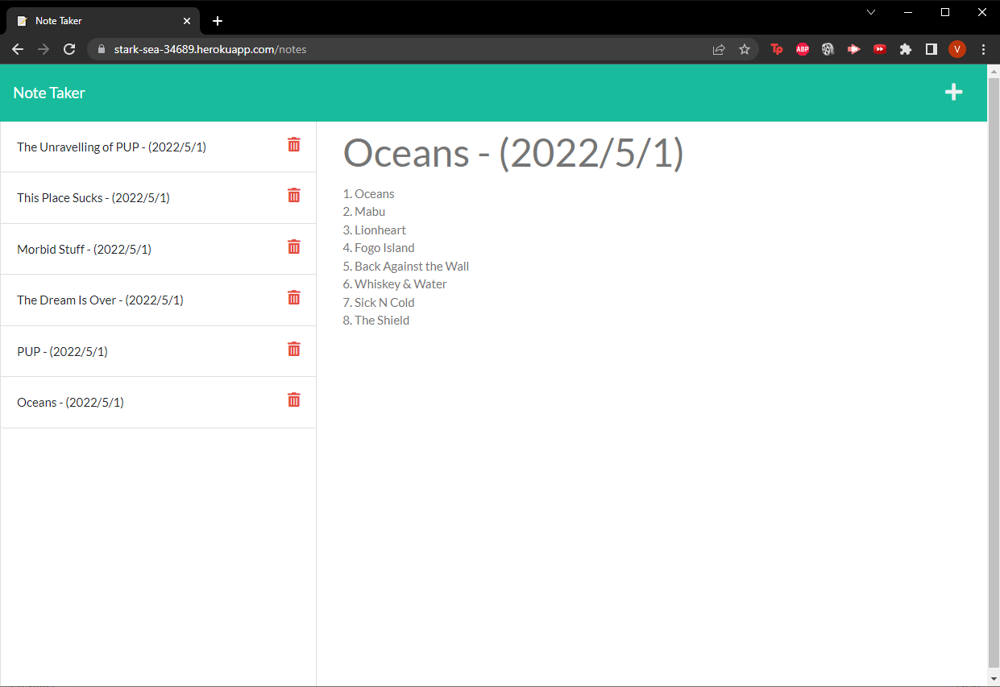

  # Note Taker
  This application uses Express.js and Heroku to host a note-taking application.
  
  ## Table of Contents
  * [Features](#features)
  * [Built With](#built)
  * [Installation](#installation)
  * [Usage Information](#usage)
  * [Authors & Acknowledgements](#credits)
  * [Contact](#questions)
  
  ## Bonus Features
  This application includes note deletion functionality. 
  This application also automatically adds a date stamp to the title of new notes.

  ## Built With
  * HTML
  * CSS
  * JavaScript
  * Node.js
  * Express.js
  * NPM uniqid
  * Heroku
  * Insomnia
    
  ## Installation 
  This application can be accessed at the live URL. For developers, after cloning the repository, ensure that npm uniqid and Express.js are installed.
  
  ## Usage Information
  [Note Taker]("https://stark-sea-34689.herokuapp.com") 
    
  This application allows users to access notes on any device. 
    
    
  ## Authors & Acknowledgements
  
  Base code © 2020 - 2022 Trilogy Education Services, a 2U, Inc. brand. All Rights Reserved.  
  
  Made by [TOVTC](https://github.com/TOVTC). 
  Originally submitted 2022May01.

  ## Assignment Information - Express.js Challenge: Note Taker
  ### User Story
  AS A small business owner 
  I WANT to be able to write and save notes 
  SO THAT I can organize my thoughts and keep track of tasks I need to complete

  ### Acceptance Criteria
  GIVEN a note-taking application 
  WHEN I open the Note Taker 
  THEN I am presented with a landing page with a link to a notes page 
  WHEN I click on the link to the notes page 
  THEN I am presented with a page with existing notes listed in the left-hand column, plus empty fields to enter a new note title and the note’s text in the right-hand column 
  WHEN I enter a new note title and the note’s text 
  THEN a Save icon appears in the navigation at the top of the page 
  WHEN I click on the Save icon 
  THEN the new note I have entered is saved and appears in the left-hand column with the other existing notes 
  WHEN I click on an existing note in the list in the left-hand column 
  THEN that note appears in the right-hand column 
  WHEN I click on the Write icon in the navigation at the top of the page 
  THEN I am presented with empty fields to enter a new note title and the note’s text in the right-hand column

  ## Questions?
  Contact repository author via [GitHub](https://github.com/TOVTC). 
    
  
  